# FortiMonitor

# Indice

- [Sobre](#sobre)
- [Acesso a ferramenta](#acesso-a-ferramenta)
- [Adicionando sua infraestrutuara ao FortiMonitor](#adicionando-sua-infraestrutra-ao-fortimonitor)
    - [FortiMonitor Agent](#fortimonitor-agent)
    - [OnSight vCollector](#onsight-vcollector)
- [Alert Timeline](#alert-timeline)
- [Infraestructure Map and Dashboard](#infraestructure-map-and-dashboard)
    - [Analisando um incidente](#analisando-um-incidente)
    - [Dashboard](#dashboard)
- [Gerenciamento de times](#gerenciamento-de-times)
    - [Usuarios e Grupos](#usuários-e-grupos)
- [Reports](#reports)

## Sobre

O FortiMonitor é uma plataforma **SaaS** (Software as a Service) de Monitoramento de Experiência Digital (DEM), desenvolvida pela Fortinet, que oferece uma visibilidade completa sobre o desempenho de aplicações e a experiência do usuário final.

### Pontos Chave:

- **Foco no Usuário e Aplicação**: Ele rastreia e analisa o desempenho e a qualidade da experiência digital do ponto de vista do usuário.

- **Modernização do Monitoramento**: Ajuda as organizações a substituírem ou complementarem ferramentas de monitoramento tradicionais, fornecendo uma visão única e unificada sobre a saúde e o desempenho de toda a jornada digital.

- **Visibilidade de Ponta a Ponta**: Fornece métricas de desempenho de endpoints (dispositivos do usuário) até o servidor de aplicação, permitindo identificar rapidamente gargalos, seja na rede, no próprio aplicativo, ou no dispositivo do usuário.

Em resumo, o FortiMonitor garante que as organizações possam manter a qualidade e a performance dos serviços digitais sobre a experiência real dos seus usuários.

## Acesso a ferramenta

Para acessar a ferramenta você deverá entrar na <a href="https://www.forticloud.com/#/">FortiCloud</a>, realizar seu login(criar sua conta se necessário), ao entrar no ambiente, você deve ir pelo menu em **Services -> FortiMonitor**

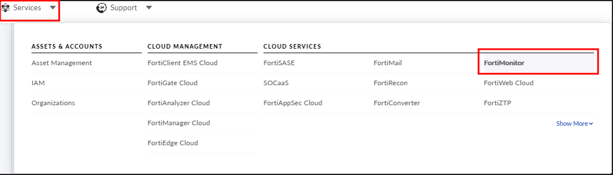

Você será redirecionado para essa tela inicial da aplicação, **Infraestructure Map**, que vai estar vazia, considerando que é seu primeiro acesso e nenhuma instância foi adicionada.

Ou se preferir, indo direto a url de acesso <a href="https://fortimonitor.forticloud.com/">aqui</a>!

## Adicionando sua infraestrutra ao FortiMonitor

Podemos adicionar diversos tipos de instâncias, iremos focar aqui em 2 tipos:

- Equipamentos FortiNet
- Endpoints

### Equipamentos FortiNet

Nesse contexto se enquadram :

- FortiGate
- FortiSwitch
- FortiAP

Nesse cenário, sua adição é feito através do FortiFabric, onde adicionamos o FortiGate via Fabric

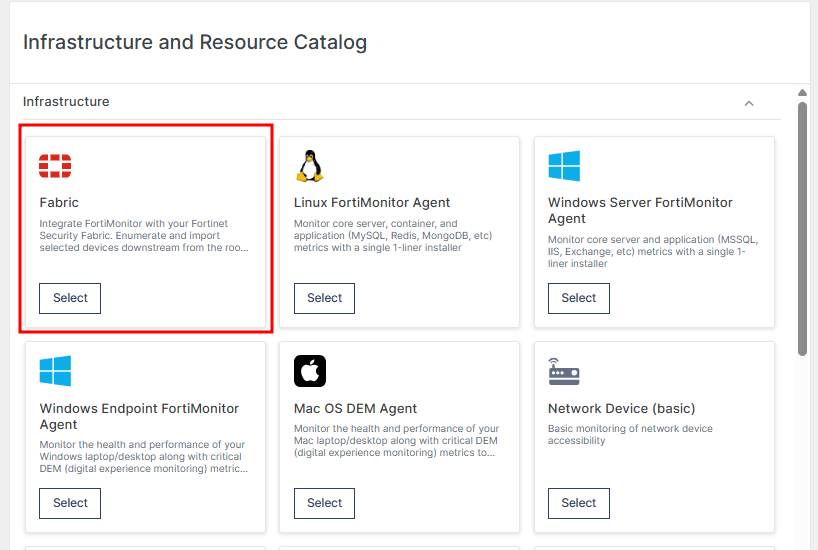
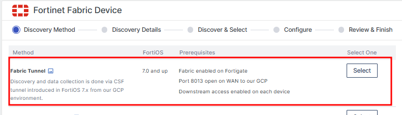
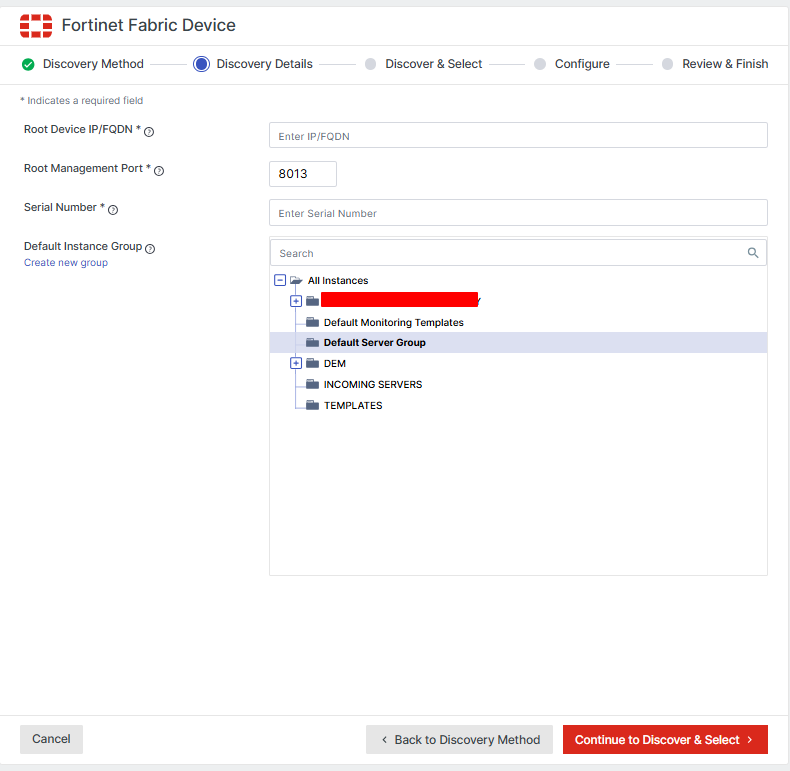

Deve ser informado o IP/FQDN do FortiGate que será o Fabric Root, a porta 8013 já esta implicita, ou seja, aberta, informe o Serial Number do equipamento.
Escolha um grupo já criado, caso não selecionado, criará um grupo default.

**Obs.: Importante informar que para que funcione, é necessário também que exista uma policy permintindo a comunicação do equipamento com o FortiMonitor.**

#### OnSight vCollector

O OnSight vCollector, é uma forma de adicionar os equipamentos via Fabric, mas sem expor diretamente na internet. 

É uma aplicação que roda em Linux, podendo ser utilizada uma Imagem já pronta, instalar de modo standalone ou utilizar Docker. Sua funcionalidade é fazer verificações em rede, sondagens SNMP e fornecer um monitoramento mais aprofundado em equipamentos de rede como :

- Firewalls
- Switchs
- Roteadores

### Endpoints

Por endpoints, vamos entender que se trata de equipamentos como Desktops ou Notebooks, onde é possivel instalar o FortiMonitor Agent, compativel com Sistemas :

- Linux
- Mac OS
- Windows

Onde nesses endpoints podemos aplicar auto healing, através de **CounterMeasures**, que são respostas(ações) automaizadas a incidentes acionados em sua infraestrutura. Podendo ser simples como anexar a saida de um _top_ ao seu incidente, afim de identificar alto consumo de CPU por exemplo, ou coisas mais complexas como reiniciar um serviços ou reiniciar o endpoint.

- Document Library <a href="https://docs.fortinet.com/document/fortimonitor/25.3.0/user-guide/645678/countermeasures"> saiba mais!</a>

Para mais informações sobre instalação, segue abaixo os links oficiais:
<ul>
<li><a href="https://docs.fortinet.com/document/fortimonitor/25.3.0/user-guide/916257/fortimonitor-agent">FortiMonitor Agent</a></li>
<li><a href="https://docs.fortinet.com/document/fortimonitor/25.3.0/user-guide/487136/install-the-fortimonitor-agent">Install the FortiMonitor Agent</a></li>
</ul>

## Alert Timeline

Todas as notificações do FortiMonitor são gerenciadas pelo "cronograma de alertas", que nada mais é do que um fluxo de trabalho altamente configurável para gerenciar alertas quando um incidente é detectado. Você pode por exemplo :

- Escolhe quem vai ser alertado
- Qual meio de notificação usar(direto por e-mail,sms ou integrar com serviços terceiros)
- O tempo que essa notificação vai ser enviada e as subsequentes

Abaixo segue um exemplo básico :

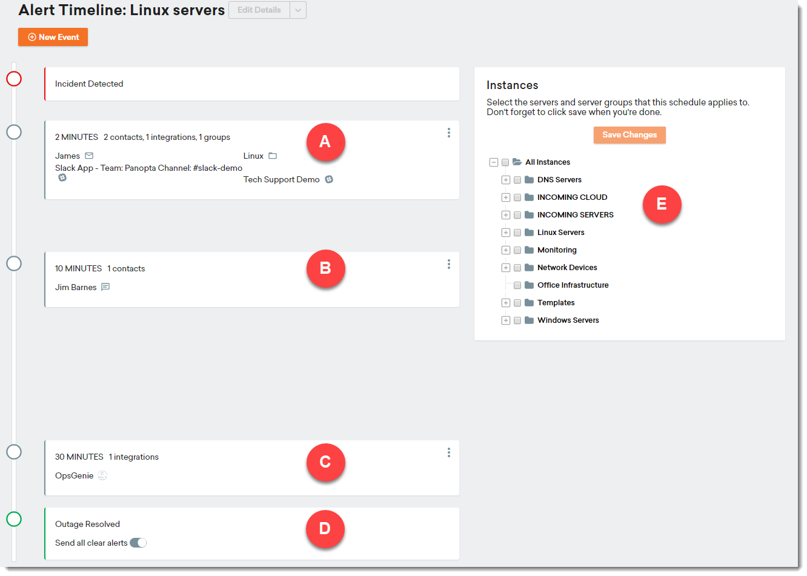

- A : Primeiro evento

    - Usuários e grupos são notificados dependendo do método de contato configurado, do cronograma On-Call ou da integração de terceiros.

    - Nesse ponto, qualquer pessoa da sua equipe pode reconhecer o problema e assumir a responsabilidade, encaminhá-lo para o próximo nível ou adiar ou cancelar todos os alertas futuros.

- B : Segundo evento

    - Neste exemplo, 10 minutos se passaram sem nenhuma resolução e um SMS é enviado ao usuário especificado.

- C : Terceiro evento

    - Após 30 minutos, o alerta aumentou ainda mais e foi relatado a uma integração de terceiros (OpsGenie).

_Observação : você pode criar quantos eventos forem necessários._

- D : Interrupção resolvida

    - Quando o incidente for resolvido, você terá a opção de enviar uma mensagem de "tudo certo". Todos os usuários, grupos ou integrações notificados anteriormente serão notificados nos canais de comunicação em que foram notificados anteriormente.

- E : Árvore de instância

    - Este cronograma de alerta é aplicado às suas instâncias e grupos selecionados

Mais informações detalhadas sobre a configuração de alertas, periodo de manutenção e Acknowledging, disponivel <a href="https://docs.fortinet.com/document/fortimonitor/25.3.0/user-guide/650128">aqui</a> .

## Infraestructure Map and Dashboard

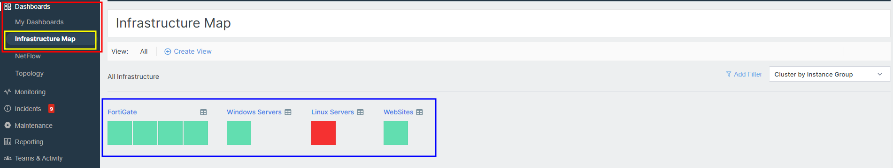

Considerando que você já adicionou suas instâncias(webservers,websites,VMs,etc), ao voltarmos a pagina inicial do FortiMonitor, iremos cair nessa tela de **Infraestructure Map**, onde vemos de forma geral todo nosso parque de equipamentos, onde, é separado por grupos :

- FortiGate
- Windows Servers
- Linux Severs
- WebSites

Passar o mouse por cima de cada bloco, carrega um modal com um resumo sobre a instância, e se clicarmos no icone de tabela, podemos ver uma breve dashboard com os recursos do equipamento com uso de cpu, uso de memória,etc.

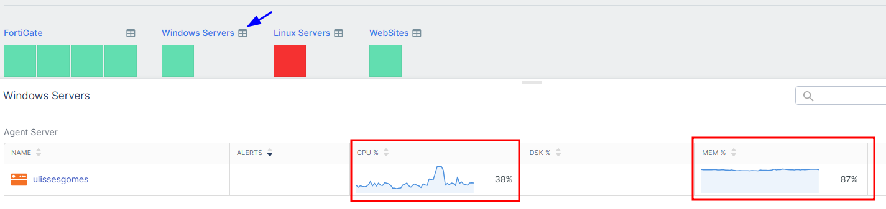

Como é visto na tela, temos um host em vermelho que significa que o mesmo esta com algum incidente, vamos analisar clicando nele :

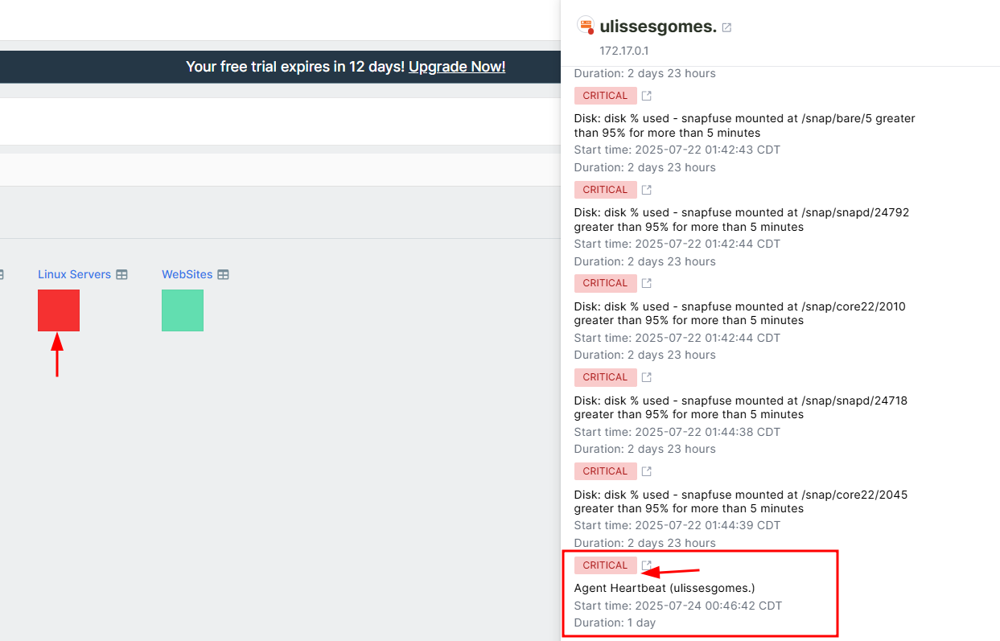

### Analisando um incidente

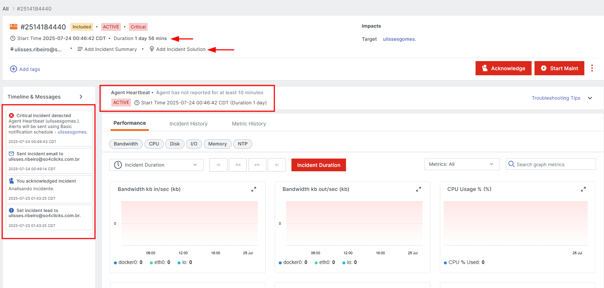

Podemos observar aqui a duração desse incidente que é de 1 dia e 58 minutos, a timeline do incidente, o tipo de alerta "**Agent Hearbeat**" indicando que o agent ficou sem se comunicar com o FortiMonitor por mais de 10 minutos.

Note que existe um campo para "**Add incident Solution**", onde podemos explicar como o problema pode ser ou como foi resolvido, nesse caso podemos inserir que foi analisado testes de comunicação (ping), acessado a VM e verificado que estaria sem rede ou desligada, e o procedimento foi ligar a VM novamente.

### Dashboard

O FortiMonitor consegue criar de forma autonoma uma dashboard básica, com base nos hosts que você adicionou, trazendo informações mais essenciais como :

- Quantidade de incidentes ativos
- Quantidade de incidentes resolvidos
- Status das instâncias

Ao clicar em "**Edit**" podemos adicionar mais widgets ou remover as que achamos desnecessárias, personalizando a necessidade do usuário.

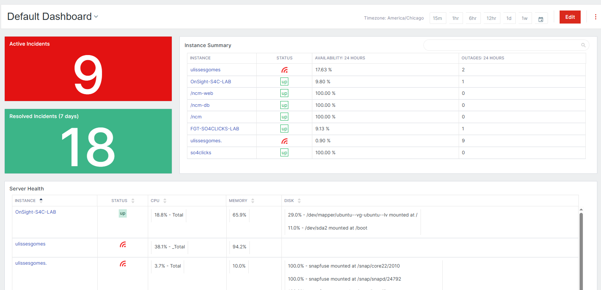

## Gerenciamento de times

### Usuários e Grupos

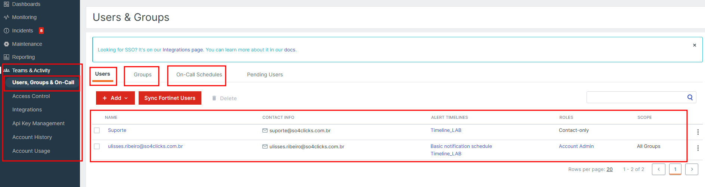

Indo em Teams & Activity -> Users,Groups & On-Call, podemos adicionar os usuários que fazem parte da organização, seperando por grupos, como :

- Suporte
- Gerência
- Etc

E Definido a escala, por exemplo :

- Das 6h da manhã até 12h os alertas são enviados ao time de suporte, a partir das 18h ao time de gerência, etc.

Em **Access Control", podemos definir as regras de acesso de cada usuário:

- Account Admin : Able to perform any activity within FortiMonitor

- Server Admin : Able to perform most activities, with the exception of user, integration, and API management, as well as a few other ancillary activities

- Dashboard Admin : Full management of dashboards

- Dashboard Viewer : Read-only access to dashboards

- Incident Responder : Slightly more advanced than a read-only user. Allows the user to view instances, start maintenance, pause monitoring, and more

- Billing Admin : Access to billing only

- API Full Access : Full access to API functionality, including read and write operations

- API Read-only Access : Read-only access to all API operations

_Trecho obtido da documentação oficial, para mais informações acessar <a href="https://docs.fortinet.com/document/fortimonitor/25.3.0/user-guide/343674/access-control">aqui</a> ._

## Reports

É possivel obter os mais diversos relatórios como :

- Incidentes
- Disponibilidade
- SD-WAN

Entre outros, selecionando o time range, e finalizando a solicitação, você receberá em instantes via e-mail.

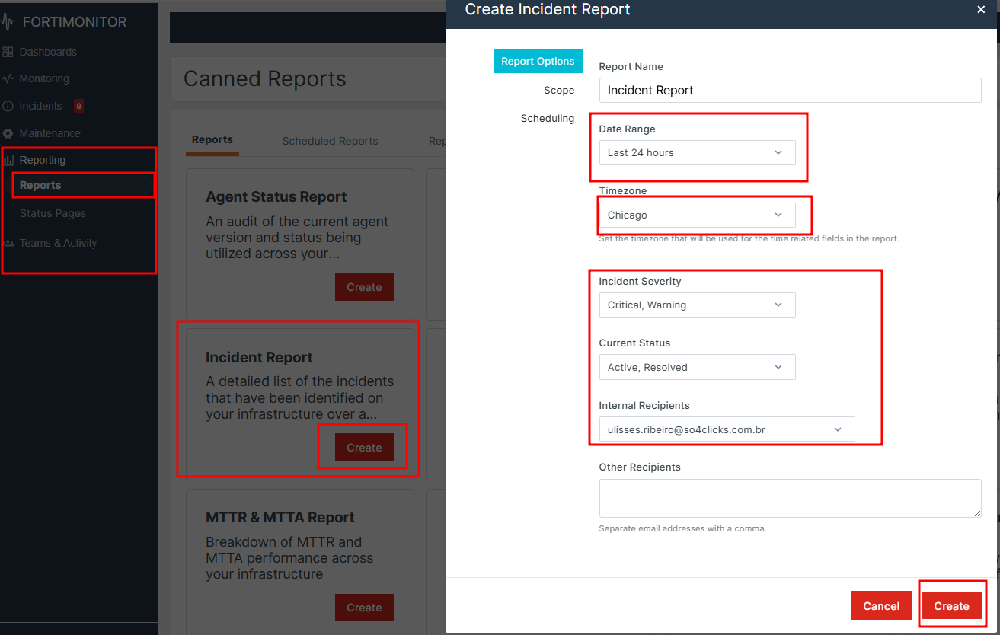