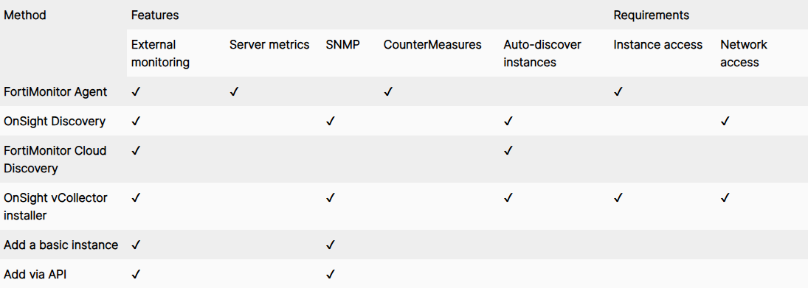
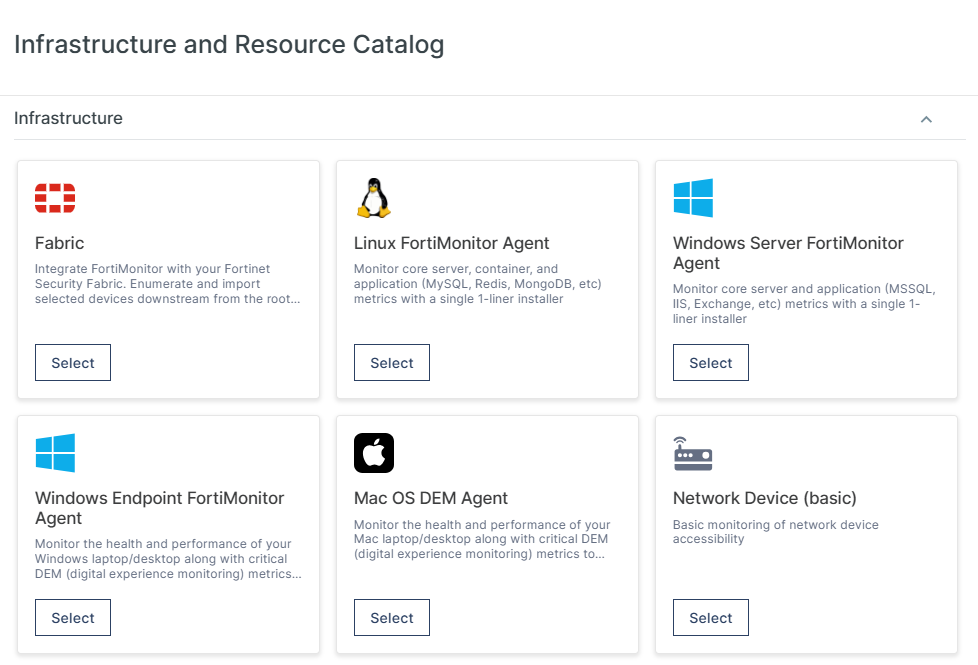
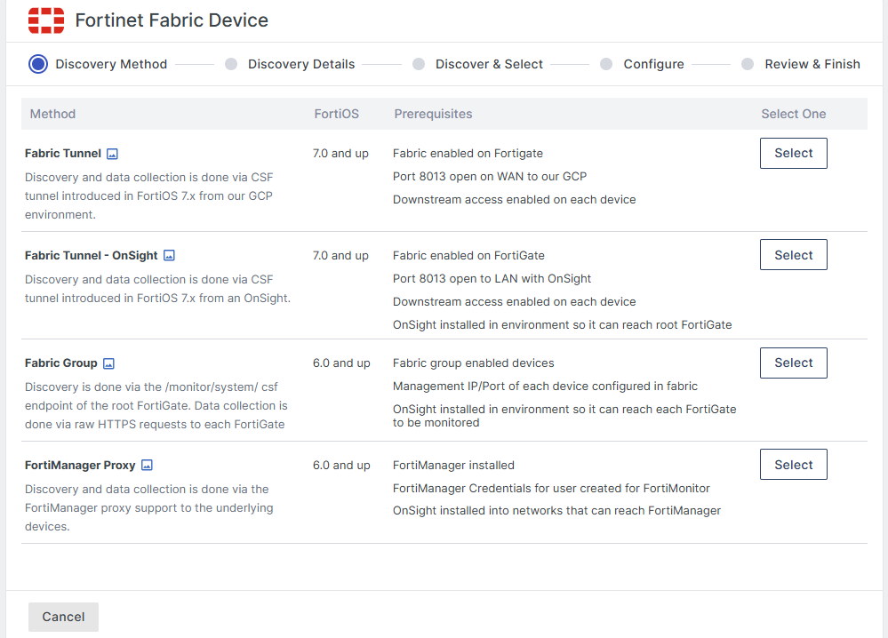
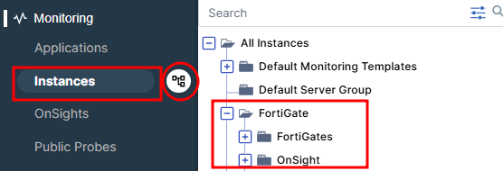
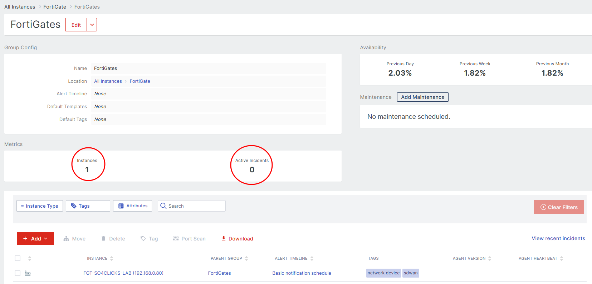

# FortiMonitor

# Indice

- [O que é o FortiMonitor](#o-que-é-o-fortimonitor)
- [Acesso a ferramenta](#acesso-a-ferramenta)
- [Adicionando sua infraestrutuara ao FortiMonitor](#adicionando-sua-infraestrutra-ao-fortimonitor)
    - [FortiMonitor Agent](#fortimonitor-agent)
    - [OnSight vCollector](#onsight-vcollector)
- [Alert Timeline](#alert-timeline)
- [Infraestructure Map and Dashboard](#infraestructure-map-and-dashboard)
    - [Analisando um incidente](#analisando-um-incidente)
    - [Dashboard](#dashboard)
- [Gerenciamento de times](#gerenciamento-de-times)
    - [Usuarios e Grupos](#usuários-e-grupos)
- [Reports](#reports)

## O que é o FortiMonitor

_O FortiMonitor é uma plataforma abrangente de monitoramento de experiência digital (DEM) baseada em SaaS que ajuda as organizações a modernizar suas ferramentas de monitoramento de desempenho. Ele fornece visibilidade de desempenho do aplicativo de endpoint e da experiência digital, não importa onde o usuário resida ou onde o aplicativo esteja hospedado._

_trecho retirado da documentação oficial._

## Acesso a ferramenta

Para acessar a ferramenta você deverá entrar na <a href="https://www.forticloud.com/#/">FortiCloud</a>, realizar seu login(criar sua conta se necessário), ao entrar no ambiente, você deve ir pelo menu em **Services -> FortiMonitor**

Você será redirecionado para essa tela inicial da aplicação, **Infraestructure Map**, que vai estar vazia, considerando que é seu primeiro acesso e nenhuma instância foi adicionada.

## Adicionando sua infraestrutra ao FortiMonitor

Nesse trecho irei descrever os diversos métodos que podem ser utilizados para adicionar sua infraestrutu ao FortiMonitor. Cada método varia em termos de "_requisitos_" , é recomendavel que revise os métodos de instalação para determinar qual a melhor opção para o seu ambiente.

### FortiMonitor Agent

O FortiMonitor Agent, é indicado para monitoramento local(on-premise),seja em Desktops ou Laptops, ou até mesmo em servidores em Cloud, que permite o monitoramento de metricas como :

- Recurso do servidor
- Processos
- Serviços

Podendo também monitorar aplicações como :

- Apache
- SQL Server
- Serviços de cache

O FortiMonitor é compativel com Sistemas :

- Linux
- Unix
- Windows

Para mais informações sobre instalação, segue abaixo os links oficiais:
<ul>
<li><a href="">FortiMonitor Agent</a></li>
<li><a href="">Install the FortiMonitor Agent</a></li>
<li><a href="">Automate the FortiMonitor Agent installation</a></li>
</ul>

### OnSight vCollector

O OnSight vCollector, é uma aplicação que roda em Linux, podendo ser utilizada uma Imagem já pronta, instalar de modo standalone ou utilizar Docker. Sua funcionalidade é fazer verificações em rede, sondagens SNMP e fornecer um monitoramento mais aprofundado em equipamentos de rede como :

- Firewalls
- Switchs
- Roteadores

O recurso minimo para fazer o deploy e utilização do OnSight vCollector, é :

- 1 Core
- 1 GB RAM

_Se feita em instância EC2(AWS), equivale á uma t3.medium ._

#### Adicionar um instência básica

Pode ter adicionado sites, endpoints, servidores, serviços, e qualquer outra coisa via FQDN ou IP, segue os passos :

- 1 - Esteja logado no FortiMonitor Control Panel.
- 2 - Acesse o menu lateral ao esquerda, no final da tela, clique em **Add**

_Você também pode ir em **Monitoring -> Instances** ._

Para o nosso principal cenário, iremos utilizar **Fabric**, que nos permite a integração nativa com equipamentos FortiNet, que tenha o recurso **Security Fabric Connection** habilitado.

Note que para cada tipo de conexão, é exigido algum requisito como :

- Versão do FortiOS
- Security Fabric Connection habilitado
- Porta 8013 acessivel pela WAN ou LAN

Uma vez escolhido a opção desejava, na tela seguinte teremos que passar algumas informações do equipamento a ser monitorado :

- IP ou FQDN
- Porta de gerenciamento
- Serial Number do equipamento
- Escolher um grupo onde esse equipamento ficará, para facilitar a gestão e troubleshootin se necessário.

Para encontrar sua instância, basta ir em **Monitoring -> Instances -> Clicar no icone referente uma arvore de arquivos, como segue o presente :

Segue a tela com um FortiGate adicionado:

## Alert Timeline

Todas as notificações do FortiMonitor são gerenciadas pelo "cronograma de alertas", que nada mais é do que um fluxo de trabalho altamente configurável para gerenciar alertas quando um incidente é detectado. Você pode por exemplo :

- Escolhe quem vai ser alertado
- Qual meio de notificação usar(direto por e-mail,sms ou integrar com serviços terceiros)
- O tempo que essa notificação vai ser enviada e as subsequentes

Abaixo segue um exemplo básico :

- A : Primeiro evento

    - Usuários e grupos são notificados dependendo do método de contato configurado, do cronograma On-Call ou da integração de terceiros.

    - Nesse ponto, qualquer pessoa da sua equipe pode reconhecer o problema e assumir a responsabilidade, encaminhá-lo para o próximo nível ou adiar ou cancelar todos os alertas futuros.

- B : Segundo evento

    - Neste exemplo, 10 minutos se passaram sem nenhuma resolução e um SMS é enviado ao usuário especificado.

- C : Terceiro evento

    - Após 30 minutos, o alerta aumentou ainda mais e foi relatado a uma integração de terceiros (OpsGenie).

_Observação : você pode criar quantos eventos forem necessários._

- D : Interrupção resolvida

    - Quando o incidente for resolvido, você terá a opção de enviar uma mensagem de "tudo certo". Todos os usuários, grupos ou integrações notificados anteriormente serão notificados nos canais de comunicação em que foram notificados anteriormente.

- E : Árvore de instância

    - Este cronograma de alerta é aplicado às suas instâncias e grupos selecionados

Mais informações detalhadas sobre a configuração de alertas, periodo de manutenção e Acknowledging, disponivel <a href="https://docs.fortinet.com/document/fortimonitor/25.3.0/user-guide/650128">aqui</a> .

## Infraestructure Map and Dashboard

Considerando que você já adicionou suas instâncias(webservers,websites,VMs,etc), ao voltarmos a pagina inicial do FortiMonitor, iremos cair nessa tela de **Infraestructure Map**, onde vemos de forma geral todo nosso parque de equipamentos, onde, é separado por grupos :

- FortiGate
- Windows Servers
- Linux Severs
- WebSites

Passar o mouse por cima de cada bloco, carrega um modal com um resumo sobre a instância, e se clicarmos no icone de tabela, podemos ver uma breve dashboard com os recursos do equipamento com uso de cpu, uso de memória,etc.

Como é visto na tela, temos um host em vermelho que significa que o mesmo esta com algum incidente, vamos analisar clicando nele :

### Analisando um incidente

Podemos observar aqui a duração desse incidente que é de 1 dia e 58 minutos, a timeline do incidente, o tipo de alerta "**Agent Hearbeat**" indicando que o agent ficou sem se comunicar com o FortiMonitor por mais de 10 minutos.

Note que existe um campo para "**Add incident Solution**", onde podemos explicar como o problema pode ser ou como foi resolvido, nesse caso podemos inserir que foi analisado testes de comunicação (ping), acessado a VM e verificado que estaria sem rede ou desligada, e o procedimento foi ligar a VM novamente.

### Dashboard

O FortiMonitor consegue criar de forma autonoma uma dashboard básica, com base nos hosts que você adicionou, trazendo informações mais essenciais como :

- Quantidade de incidentes ativos
- Quantidade de incidentes resolvidos
- Status das instâncias

Ao clicar em "**Edit**" podemos adicionar mais widgets ou remover as que achamos desnecessárias, personalizando a necessidade do usuário.

## Gerenciamento de times

### Usuários e Grupos

Indo em Teams & Activity -> Users,Groups & On-Call, podemos adicionar os usuários que fazem parte da organização, seperando por grupos, como :

- Suporte
- Gerência
- Etc

E Definido a escala, por exemplo :

- Das 6h da manhã até 12h os alertas são enviados ao time de suporte, a partir das 18h ao time de gerência, etc.

Em **Access Control", podemos definir as regras de acesso de cada usuário:

- Account Admin : Able to perform any activity within FortiMonitor

- Server Admin : Able to perform most activities, with the exception of user, integration, and API management, as well as a few other ancillary activities

- Dashboard Admin : Full management of dashboards

- Dashboard Viewer : Read-only access to dashboards

- Incident Responder : Slightly more advanced than a read-only user. Allows the user to view instances, start maintenance, pause monitoring, and more

- Billing Admin : Access to billing only

- API Full Access : Full access to API functionality, including read and write operations

- API Read-only Access : Read-only access to all API operations

_Trecho obtido da documentação oficial, para mais informações acessar <a href="https://docs.fortinet.com/document/fortimonitor/25.3.0/user-guide/343674/access-control">aqui</a> ._

## Reports

É possivel obter os mais diversos relatórios como :

- Incidentes
- Disponibilidade
- SD-WAN

Entre outros, selecionando o time range, e finalizando a solicitação, você receberá em instantes via e-mail.

