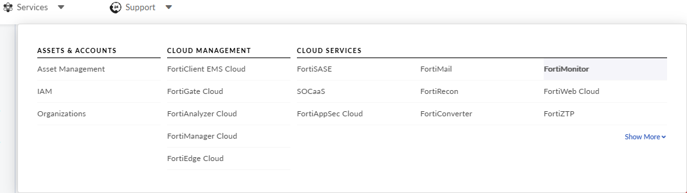
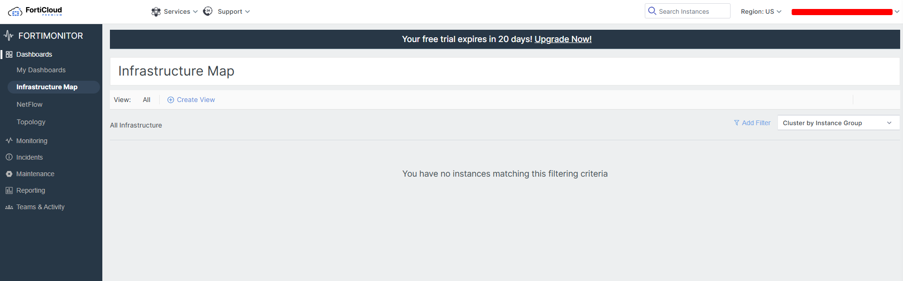
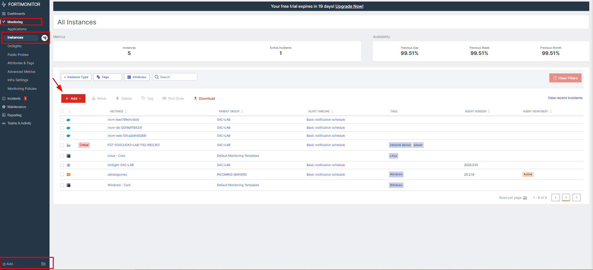
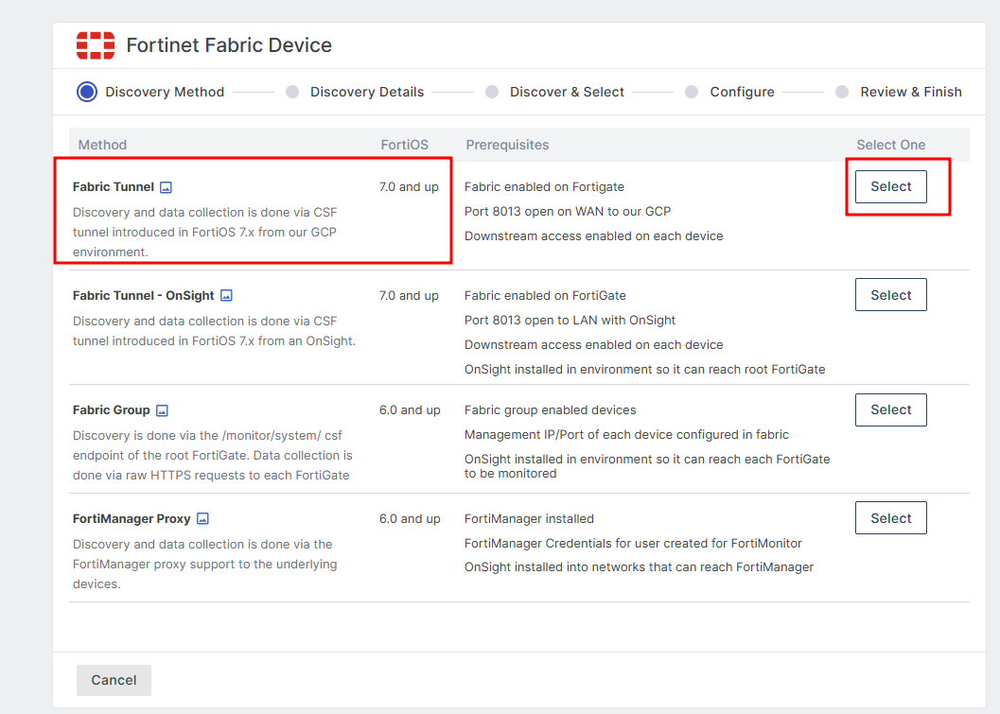
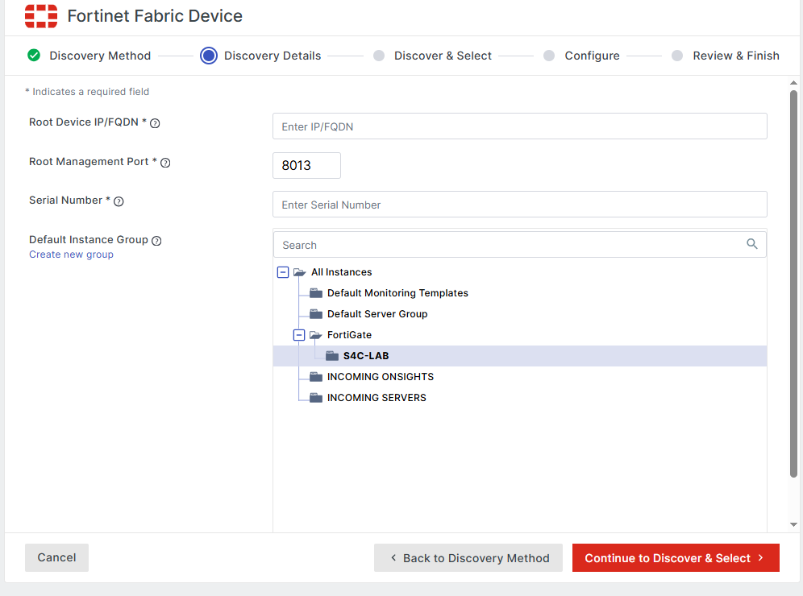
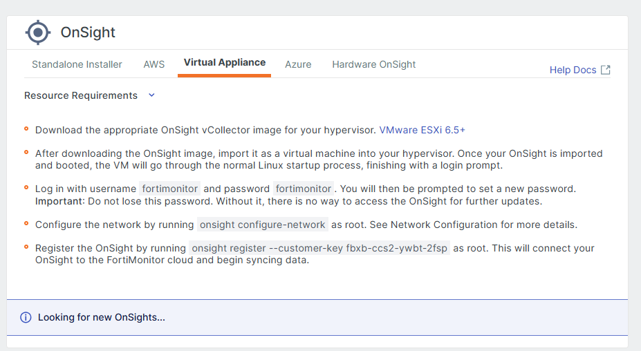

# FortiMonitor

## O que é o FortiMonitor

_O FortiMonitor é uma plataforma abrangente de monitoramento de experiência digital (DEM) baseada em SaaS que ajuda as organizações a modernizar suas ferramentas de monitoramento de desempenho. Ele fornece visibilidade de desempenho do aplicativo de endpoint e da experiência digital, não importa onde o usuário resida ou onde o aplicativo esteja hospedado._

_trecho retirado da documentação oficial._

## Acesso a ferramenta

O acesso a ferramenta está vinculado a sua conta da FortiCloud, indo em Services -> FortiMonitor

Sendo redirecionando para essa tela :

## Adicionando instâncias

Para adicionar instâncias/hosts, basta ir e Monitoring > Instances(Note que ao lado de instances existe um icone de uma arvore, por ali conseguimos navegar por pastas/grupos), clique em **+Add** e escolha se quer criar uma grupo onde seus hosts vão ficar agrupados ou instances em stand alone. Se você for no final da tela também terá o botão **+Add** que vai direto ao ponto(próxima tela) .

## Tipos de instâncias

Podemos coletar pelo FortiMonitor não apenas equipamentos da FortiNet, mas também servidores e Desktops Linux, Windows e Mac,sendo o nosso foco aqui os equipamentos FortiNet, onde escolheremos o **Fabric**

Onde na próxima tela será solicitado alguns dados do equipamento :

- Root Device IP/FQDN : Pode ser passado o IP ou FQDN.
- Root Management Port : não precisa ser alterado, pois essa porta já é implicita nos equipamentos que tenham o Fabric habilitado.
- Serial Number : Como o próprio nome diz, o serial do equipamento.
- Defaul Instance Group : Podemos adicionar cada equipamento em pastas/grupo, para manter uma melhor organização e facil manutenção.

_Passos além daqui só irei conseguir após ter acesso ao ambiente real_

### Adicionando instances - Ambiente de Laboratório

Em ambiente de laboratório, foi necessário usar um Endpoint para poder fazer meu lab privado se comunicar com a cloud, escolheremos **OnSight vCollector**

Note que é possivel usar o OnSight de forma Standalon, numa instancia da AWS, Virtual Appliance (Vmware Workstation,ESXi), Azure, etc. Em meu caso foi o Virtual Appliance, basta seguite os passos informados na tela.

